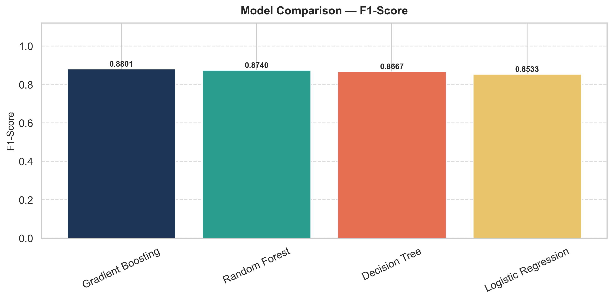
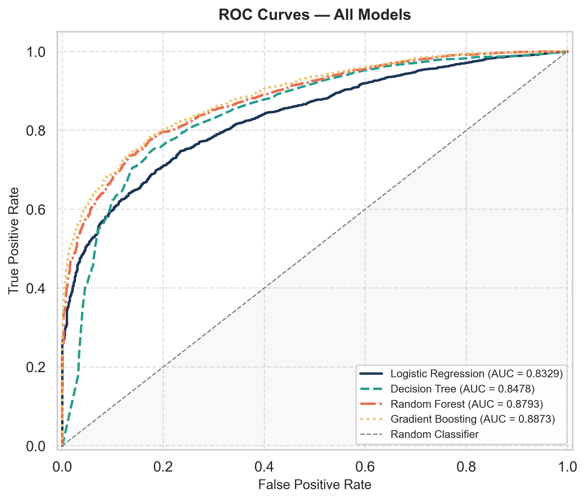
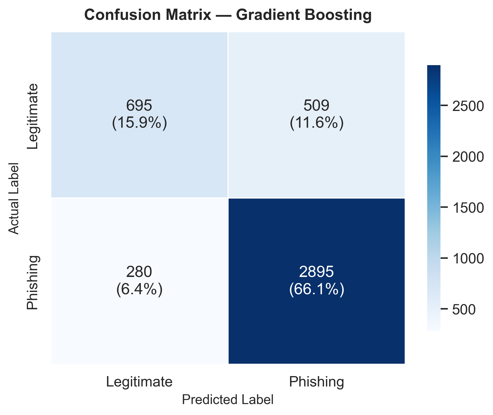
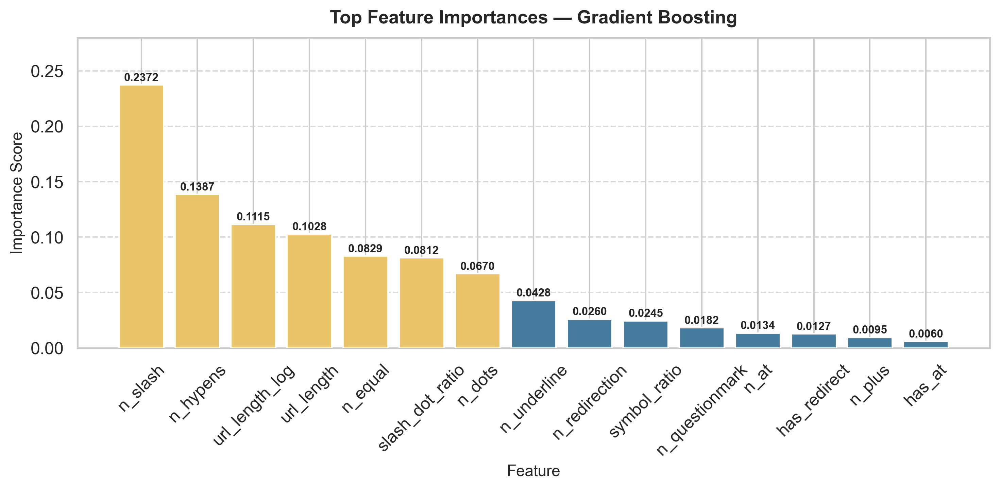
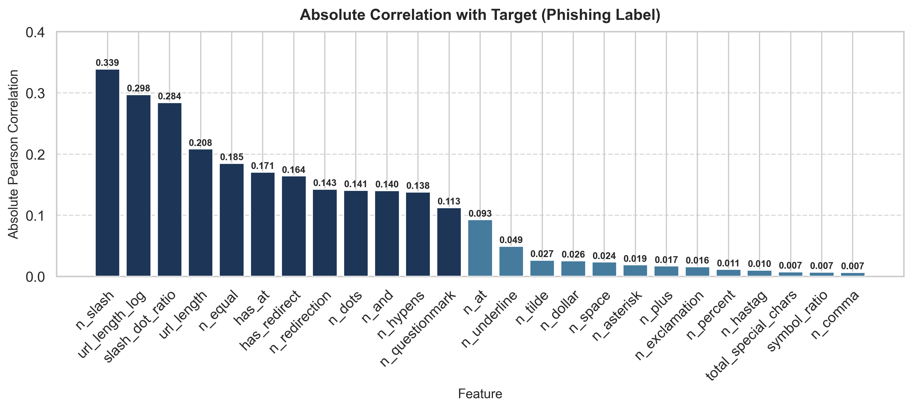

# Phishing URL Detection using Machine Learning

> PSUT — Artificial Intelligence (AI) — Final Project

## Authors

| Name | Student ID | Email |
|------|-----------|-------|
| Saleh Alsaheb | 20220045 | sal20220045@std.psut.edu.jo |
| Ismael Alhindi | 20220379 | ism20220379@std.psut.edu.jo |

**Institution:** Princess Sumaya University for Technology (PSUT), Amman, Jordan

---

## Overview

This project evaluates four classical machine learning classifiers for phishing URL detection using only URL-based lexical features. The pipeline covers data cleaning, feature engineering, hyperparameter tuning (GridSearchCV), cross-validation, and held-out test evaluation — all reproducible from a single entry script.

**Best result:** Gradient Boosting — F1 = **0.880**, Recall = **0.912**, ROC-AUC = **0.887**

---

## Dataset

- **Source:** [Web Page Phishing Detection Dataset](https://www.kaggle.com/datasets/danielfernandon/web-page-phishing-dataset) — Kaggle
- **Download:** place the CSV at `data/web_page_phishing.csv`
- 100,077 rows → 21,891 unique rows after deduplication
- 19 URL-derived numerical features + 1 binary target (`phishing`)
- 6 additional features engineered in the pipeline

---

## Results

| Model | Accuracy | Precision | Recall | F1 | ROC-AUC |
|---|---|---|---|---|---|
| **Gradient Boosting** | **0.8198** | **0.8505** | **0.9118** | **0.8801** | **0.8873** |
| Random Forest | 0.8102 | 0.8429 | 0.9074 | 0.8740 | 0.8793 |
| Decision Tree | 0.8022 | 0.8476 | 0.8866 | 0.8667 | 0.8478 |
| Logistic Regression | 0.7753 | 0.8101 | 0.9014 | 0.8533 | 0.8329 |

All models tuned with GridSearchCV (5-fold stratified CV, scored on F1).

---

## Figures

<p align="center">
  
  
</p>

<p align="center">
  
  
</p>

<p align="center">
  
</p>

---

## Setup

```bash
python -m venv .venv
source .venv/bin/activate        # Windows: .venv\Scripts\activate
pip install -r requirements.txt
```

Place the dataset at `data/web_page_phishing.csv` (see Dataset section above).

---

## Run

```bash
python run_experiment.py --data data/web_page_phishing.csv --target phishing
```

The script will:
1. Load and inspect the dataset (shape, missing values, class distribution)
2. Remove duplicate rows
3. Engineer 6 derived features
4. Stratified 80/20 train/test split
5. 5-fold cross-validation on all four models
6. GridSearchCV hyperparameter tuning
7. Evaluate on held-out test set
8. Save figures → `outputs/figures/`, tables → `outputs/tables/`, model → `outputs/models/`

---

## Project Structure

```
.
├── data/                          # Dataset (not in repo — download from Kaggle)
├── notebooks/
│   └── 01_exploration_and_modeling.ipynb
├── outputs/
│   ├── figures/                   # 9 generated PNG figures
│   ├── models/                    # Model metadata JSON
│   └── tables/                    # 7 result CSV tables
├── paper/
│   ├── URL-Project.pdf            # IEEE-format final report
│   └── URL-Project.docx           # Editable version
├── presentation/
│   └── presentation_outline.md
├── src/
│   ├── config.py                  # Paths and constants
│   ├── data_loader.py
│   ├── preprocessing.py           # Duplicate removal + feature engineering
│   ├── train_models.py
│   ├── evaluate_models.py
│   ├── visualize.py
│   └── utils.py
├── run_experiment.py              # Main entry point
└── requirements.txt
```

---

## Report

The full IEEE-format paper is available at [`paper/URL-Project.pdf`](paper/URL-Project.pdf).
